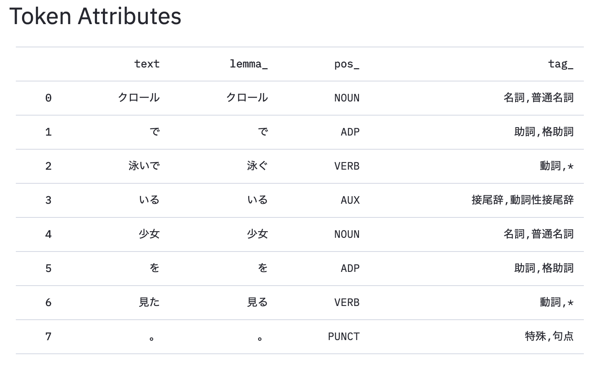
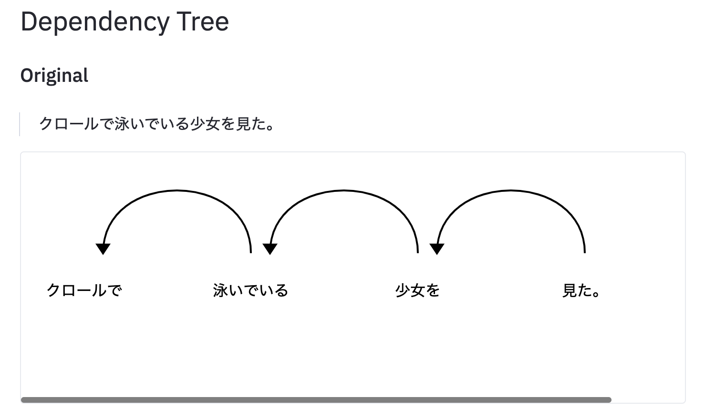
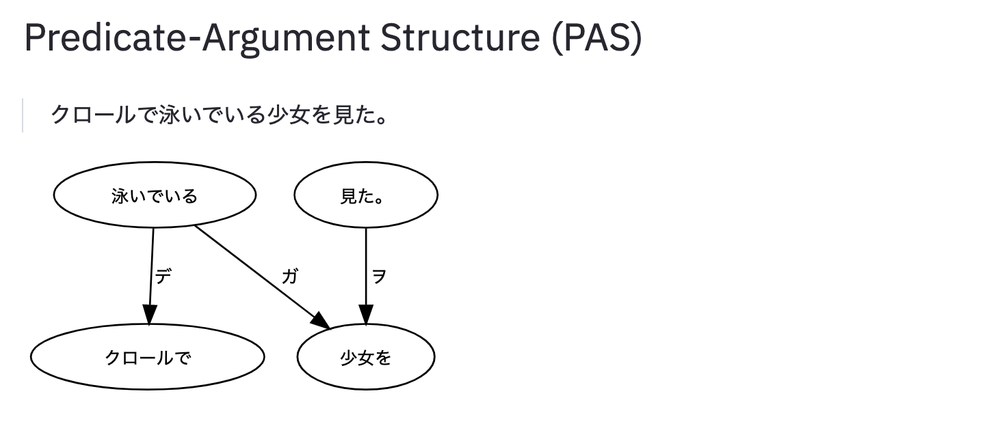

# KNP Visualizer


## Install

```bash
docker build https://github.com/yasufumy/knpviz.git#main -t knpviz
docker run --rm -p 8501:8501 -it knpviz  # Go to http://localhost:8501 on your browser
```


## Features

### Token Attributes




### Dependency Tree



### Predicate-Argument Structure


